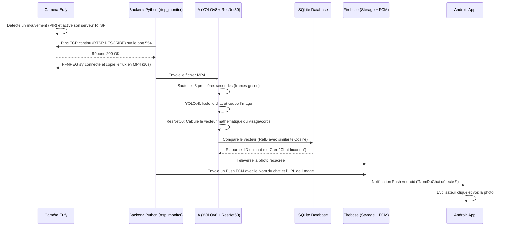

# 🐾 PokeMinou : Architecture Logicielle

Ce document décrit en détail l'architecture technique, les flux de données et l'organisation des modules du système **PokeMinou**.

---

## 1. Vue d'Ensemble du Système (High-Level Architecture)

Le système PokeMinou est divisé en deux grandes entités :
1. **Le Backend Serveur (Windows)** : Gère l'interception du matériel Eufy, le traitement vidéo, l'Intelligence Artificielle (Vision) et la base de données.
2. **Le Client Mobile (Android)** : Reçoit les alertes traitées via le cloud et affiche les profils des chats détectés.

### Diagramme de Flux de Détection

---

## 2. L'Écosystème Backend (Dossier `Windows/`)

Le backend est structuré en modules indépendants (Separation of Concerns). Ce backend est désormais un monolithe 100% Python.

### A. La Couche d'Interception (Bouclier Local RTSP)
### 2. Radar RTSP Local (`rtsp_monitor.py`)
- **Dédoublement d'instances (Multi-Caméras) :** Le module supporte désormais une liste d'URLs RTSP (séparées par une virgule). Il lance un "cerveau" indépendant (instance) pour chaque caméra.
- **Bouclier TCP :** Envoie un ping (`DESCRIBE`) sur le port 554 de la caméra toutes les 2 secondes.
- **Réveil :** Si la caméra répond `200 OK`, cela signifie qu'elle a détecté un mouvement via son capteur PIR et qu'elle s'est allumée.
- **Capture Indépendante :** Lance immédiatement `ffmpeg` pour capturer 10 secondes de vidéo en mode "copy" (zéro délai de ré-encodage). Chaque caméra enregistre son propre fichier (`stream_Cam1.mp4`, `stream_Cam2.mp4`...) pour éviter les collisions.

### B. Le Cœur Python (Core & Utils)
- **Localisation** : `Windows/core/` et `Windows/utils/`
- **Rôle** : Orchestrateur principal (`main.py`). Il coordonne le moniteur RTSP, le gestionnaire de base de données, le nettoyeur de disque, et l'interface Web Gradio.

### C. Le Pipeline d'Intelligence Artificielle (AI)
- **Localisation** : `Windows/ai/`
- **Composants** :
  1. **YOLOv8 (Object Detection)** : Scanne les images extraites pour trouver précisément la "Bounding Box" d'un chat. Il élimine les faux positifs (humains, voitures). Le seuil de confiance est dynamique.
  2. **Crop Engine** : Découpe l'image originelle pour ne garder que le carré contenant le chat.
  3. **ResNet50 (Re-Identification / ReID)** : Transforme l'image découpée en une matrice mathématique de 2048 dimensions (vecteur de caractéristiques).

### D. Persistance et Base de Données (DB)
- **Localisation** : `Windows/db/` et `Windows/data/`
- **Technologie** : SQLite3 (`pokeminou.db`)
- **Rôle** : Compare le vecteur généré par l'IA avec tous les vecteurs de chats connus en base de données en utilisant la "Distance Cosine". Si la correspondance dépasse 80% (par défaut), le chat est reconnu. Sinon, un profil "Chat Inconnu" est généré.
- Un système de "Cooldown" est stocké en mémoire pour éviter le spam si le même chat reste devant la caméra. Les paramètres globaux sont sauvegardés dans `settings.json`.

### E. Le Lien Cloud (Firebase)
- **Localisation** : `Windows/cloud/`
- **Rôle** : Firebase Admin SDK téléverse l'image du chat sur Google Cloud Storage, obtient une URL publique, et prépare un "Data Payload" JSON. Il expédie ensuite ce Payload via Firebase Cloud Messaging (FCM) sur le topic `all`.
- **Script de Nettoyage** : Une tâche planifiée tourne à 3h00 du matin pour effacer les photos Firebase vieilles de plus de 48h, empêchant ainsi de saturer le cloud gratuit.

### F. L'Interface d'Administration (UI)
- **Localisation** : `Windows/ui/`
- **Technologie** : Gradio (Port 8095)
- **Rôle** : Un Dashboard accessible via le navigateur. Permet de voir le statut 🟢/🔴 du pont Eufy, d'afficher la galerie des détections, de corriger les erreurs de l'IA (modifier le nom d'un chat), et d'ajuster les curseurs de sensibilité (YOLO / Cooldown) en temps réel.

---

## 3. L'Application Mobile (Dossier `Android/`)

- **Technologie** : Kotlin et Jetpack Compose.
- **Rôle** : Application minimaliste et esthétique (Neumorphisme / Dark Mode) dont l'unique travail est d'écouter le Cloud Firebase.
- **Fonctionnement Push** : L'application n'utilise ni de batterie ni de données en arrière-plan. Elle attend d'être réveillée par le système Android. Quand le "Data Payload" contenant `image_url` arrive, une notification est affichée. Au clic, la librairie **Coil** télécharge et affiche l'image en pleine résolution.

---

## 4. Chaîne de Lancement Windows (Boot Sequence)

L'ordre de démarrage est primordial pour la stabilité et la prévention de l'écrasement des processus (Zombies).

1. `StartPokeMinou.vbs` : Exécute le lancement sans afficher d'invite de commande noire à l'écran.
2. `start_silent.bat` : Redirige tous les logs vers `Windows/startup.log` (mode `>>` pour conserver l'historique).
3. `system_engine.bat` : 
   - Injecte les variables `.env`.
   - Lance le script de synchronisation `sync_env.py` pour configurer le pont Eufy.
   - Ouvre le pont Node.js (`run_node.bat`) en arrière-plan.
   - Fait une pause de 5-6 secondes pour s'assurer que le port 3000 est ouvert.
   - Active l'environnement virtuel Python (`venv`) et lance `main.py`.

*(Note : `stop.bat` utilise WMI pour cibler spécifiquement l'exécutable Python et les arguments `main.py` afin de tuer l'application sans affecter d'autres scripts Python tournant sur le PC).*
